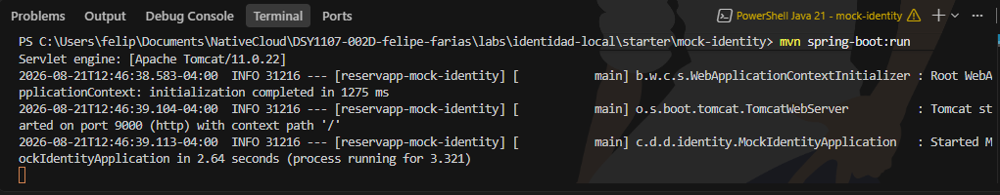
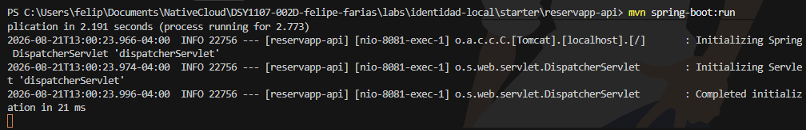
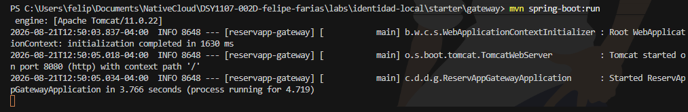
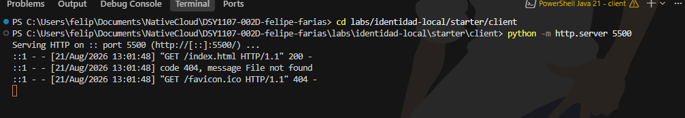
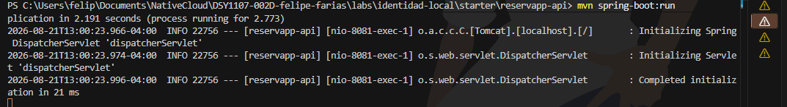

# Etapa A · Levantar y reconocer la aplicación

Sigan las instrucciones de [`starter/README.md`](./starter/README.md) y levanten:

1. `mock-identity` en `9000`;
2. `reservapp-api` en `8081`;
3. `gateway` en `8080`;
4. `client` en `5500`.

No modifiquen código todavía.

## Evidencia

En el README del grupo registren:

- los cuatro componentes levantados;




- qué rol conceptual cumple cada uno;
- una captura o salida que demuestre que ReservApp está operativa.


---

# Etapa B · “Continuar con Google” vs “Conectar Google Drive”

Antes de probar ReservApp, relacionen el laboratorio con algo cotidiano.

### Caso 1 · Continuar con Google

Una aplicación permite reconocer al usuario usando su identidad Google.

Preguntas:

1. ¿La aplicación recibe la contraseña de Google?

R:No, la contraseña nunca sale de los servidores de Google

2. ¿Qué problema principal estamos resolviendo?

R: Utilizando la cuenta de google se evita crear y gestionar nuevas credenciales

3. ¿Qué papel cumple Google?

R: Actua como Proveedor de Identidad

4. ¿Cómo se relaciona este caso con OIDC?

R: Google es el Proveedor de OpenID  

### Caso 2 · Conectar Google Drive

El usuario ya inició sesión, pero ahora una aplicación desea abrir o guardar archivos en Drive.

Preguntas:

1. ¿El login anterior entrega automáticamente acceso al Drive?

R: No, Solo entrega un token de identidad

2. ¿Qué recurso protegido aparece ahora?

R: El Token ID solo verifica quien eres, pero no da el permiso explicito que se necesita.

3. ¿Por qué hace falta autorización adicional?

R: Autorizacion y autenticacion son conceptos diferentes, No se puede tener autorizacion sin Autenticacion.

4. ¿Cómo se relaciona este caso con OAuth2?

R:Este es exactamente el escenario para el que OAuth 2.0 fue diseñado originalmente: autorización delegada a recursos


Conclusión esperada:

```text
reconocer quién eres ≠ obtener permiso para usar otro recurso
```

---